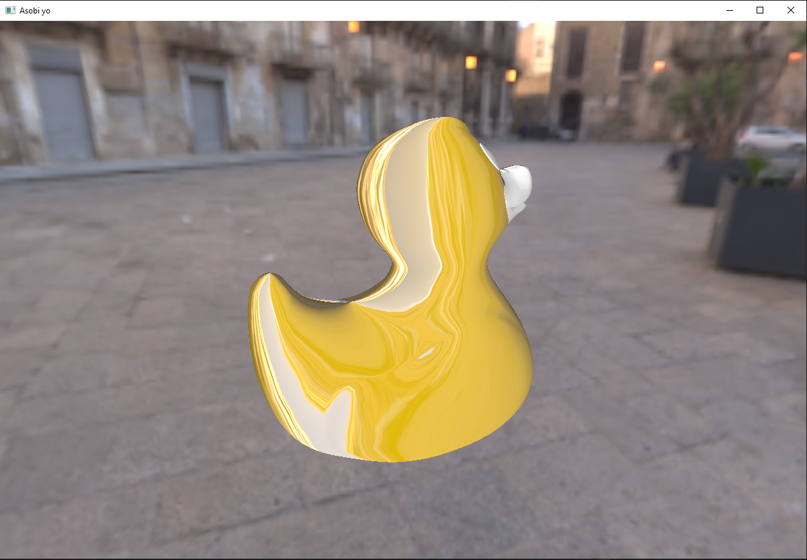
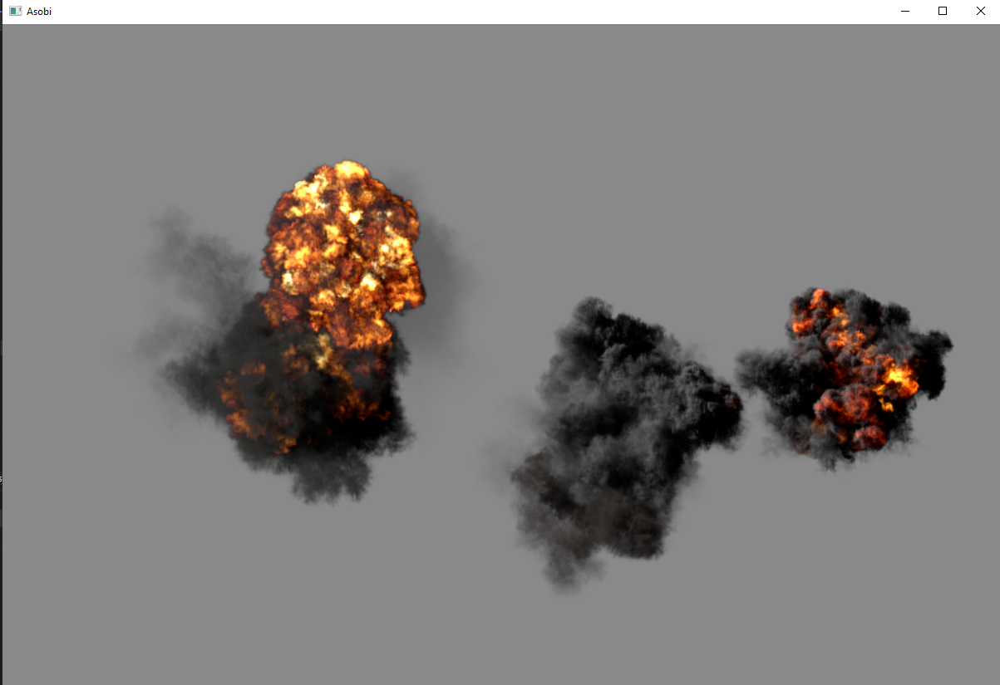

# Mai — A Lightweight Vulkan Wrapper
MAI is a modern, lightweight C++ wrapper around Vulkan, designed to reduce boilerplate while preserving explicit control.
It is built with engine development in mind, not as a full game engine, but as a flexible foundation you can extend and adapt.

## 🎯 Focus

mai is designed around a few core principles:

- **Minimal abstraction** — avoid hiding Vulkan concepts behind unnecessary layers
- **Explicit ownership** — clear and predictable lifetime management of GPU resources
- **Vulkan-first design** — APIs closely mirror Vulkan concepts and behavior
- **Practical engine workflows** — built to support real-world graphics and compute pipelines

## 🖼️ Demos

Here are some demos showcasing mai in action.

### Cubemap Textures

### Flipbook Animation

You can find the source code for these demos in the [Asobi_Yo](https://github.com/razarevel/asobi_yo).
